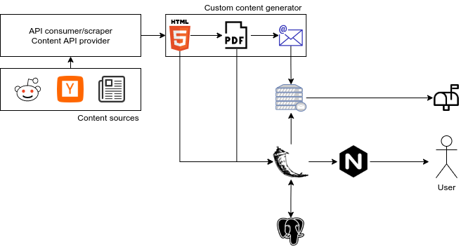

Solution architecture
=====================

Development environment
=======================
To start developing on the project you should:

#. Clone the repo if you haven't already : `git clone @github.com:triglex/papernews.git`
#. Create and activate a new virtual environment: `?`
#. Install development requirements `pip3 install -r requirements-dev.txt`
#. Run tests to check if everything is working `make ci`

Deployment
==========
Todo.