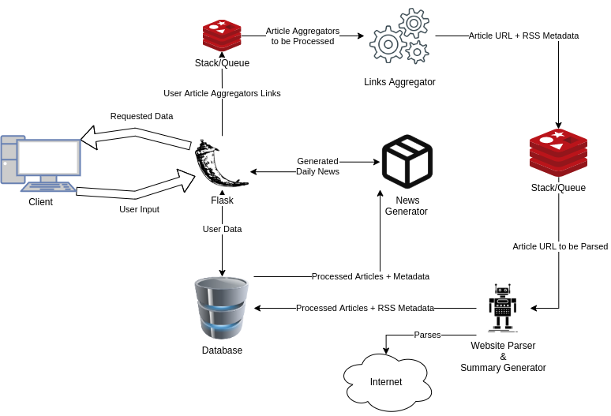

Specification
=============

Table of contents 

#. Description purpose of Papernews
#. Components
#. Interaction between components
#. Estimated time and cost

Description and purpose of Papernews
------------------------------------
Papernews is an application for generating short summary from given news agregators or directly from a newsletters web sites.
The user can define which news he wants to follow and the application will generate new Papernews at the end of each day.
The user will be given the Papernews as portable document format that he can recieve via e-mail or he can chose to download it.

Components
----------

Papernews has the following components:

#. Web interface
#. Links agregator
#. Website parser
#. News generator
#. Parsed news API
#. NLP summary and topic generator
#. Parsers and scrapers for news without RSS
#. User created list of news for category
#. Multiple Papernews templates

Web interface
^^^^^^^^^^^^^

User can see a landing page that describes Papernews features.
User can register, login remove or edit his account. If user is logged in,
he will be able to access the news page. On the news page, user can filter 
different sources of article aggregators (news providers). There are multiple
options to filter by:
    * default article aggregators (hackernews, reddit)
    * custom user provided article aggregators
    * category (multiple premade article aggregators) for eg. sports, politics
    * specific daily news genereted for the chosen hour
  
User can also search articles by:
    * article id
    * web interface will create short article ID that will ease access to the 
      news if user printed his daily news on paper.
    * for example below the heading of one news there will be an ID like 
      "123abcd" and user will be able to search that news by ID or access 
      https://papernews.com/short/123abcd to view that specific news article.
    * article date created
    * article keywords
    * article category

User can choose between different templates (looks) for generating daily news.
User can get his generated daily news:
    * via e-mail
    * as HTML
    * as PDF

Links agregator
^^^^^^^^^^^^^^^
RSS metadata extractor
    * Component that recieves user RSS links, transforms it and prepares it for website parser.
    * Specifically extracts metadata from RSS like:
        #. news heading
        #. user that posted that link
        #. source link (eg. hackernews)
        #. link to the actual news

NoRSS metadata extractor
    * Component that recieves raw user links (without RSS support), scrapes them and prepares it for website parser.
    * Specifically extracts metadata like:
        #. news heading
        #. user that posted that link
        #. source link (eg. hackernews)
        #. link to the actual news

Website parser
^^^^^^^^^^^^^^
Using prepared links scrapes website for summary of that news.
After scraping it glues metadata from agregator and prepares newly created blob of data for news generator

* Global scraper for key metadata (key = crucial parameters from which the Papernews content will be generated, parameters are: html.body, html.title, html.p) | (Estimate 8h) | I1
* Integration with "smmry" from scraped data (scraped in step 2.) | (Estimate 8h) | I2

News generator
^^^^^^^^^^^^^^
Uses data from webside parser, and generates portable document format that can be downloaded or sent via e-mail to your address.

Database
^^^^^^^^
Database that stores information about users and Papernews

Application deployment
^^^^^^^^^^^^^^^^^^^^^^
Deployment of the Papernews applcaiton

Interaction between components
------------------------------

Estimated time and cost
-----------------------
.. image:: img/timeestimate.png
  :alt: Estimated time of imlpementation

Estimated cost for 22 days of 2 developers is 

#. 22 days * 8h * 2 developers - 352, since our cost is $35/h the cost of programming and designing is $12320.
#. Maintance 10h - $350
#. Overhead 4h - $140

**Total of $12810**

Work Breakdown Structure (WBS)
------------------------------
1. Develop project schedule | (Estimate 2h BC/4h WC) | I1
2. Database | (Estimate 4h BC/8h WC)
    * Database diagram | (Estimate 4h) | I1
3. Web interface | (Estimate 41h BC/80h WC)
    * Papernews Frontend | (Estimate 17h)
        * Landing page | (Estimate 5h)
            * SEO (search engine optimizaion) | (Estimate 4h) | I3
            * Page that describes Papernews features | (Estimate 1h) | I2
        * Design and implementation of Papernews templates | (Estimate 6h)
            * Custom templates design | (Estimate 3h) | I1
            * Custom templates implementation | (Estimate 3h) | I2
        * Static parts of Papernews | (Estimate 6h)
            * User pages (Login, Register, User profile) | (Estimate 3h) | I1
            * Base layout (news checkbox filter, navbar) | (Estimate 3h) | I1
    * Papernews Backend | (Estimate 24h)
        * User operations | (Estimate 3h)
            * User CRUD and autentication on Papernews application | (Estimate 3h) | I1
        * News operations | (Estimate 21h)
            * User defined sources of news (in form of links/custom urls) | (Estimate 10h) | I2
            * Search (by date, name, keywords,...) | (Estimate 5h) | I2
            * Unique short id generator for news and daily news | (Estimate 1h) | I2
            * Per hour frontpage generator | (Estimate 1h) - @kelj0 | I2
            * Export of daily news in desired format | (Estimate 3h) | I1
            * Subscription filter | (Estimate 1h) | I1
4. Links agregators | (Estimate 12h BC/20h WC)
    * Metadata extractor from RSS | (Estimate 2h) | I1
    * Metadata extractor for websites without RSS support | (Estimate 10h) | I2

5. Website parser | (Estimate 16h BC/25h WC)
    * Global scraper for key metadata (key = crucial parameters from which the Papernews content will be generated, parameters are: html.body, html.title, html.p) | (Estimate 8h) | I1
    * Integration with "smmry" from scraped data (scraped in step 2.) | (Estimate 8h) | I2
6. Deployment | (Estimate 10h BC/15h WC)
    * Application deployment | (Estimate 10h) | I3

Iterration estimate
------------------------------
#. I1 estimate 32h BC / 60h WC
#. I2 estimate 39h BC / 80 WC
#. I3 estimate 14h BC / 20 WC
